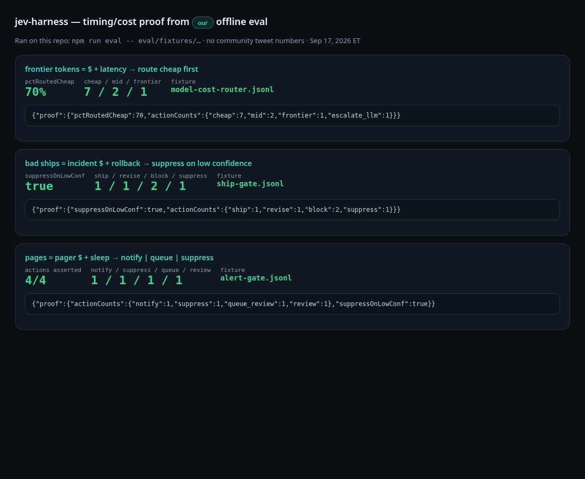
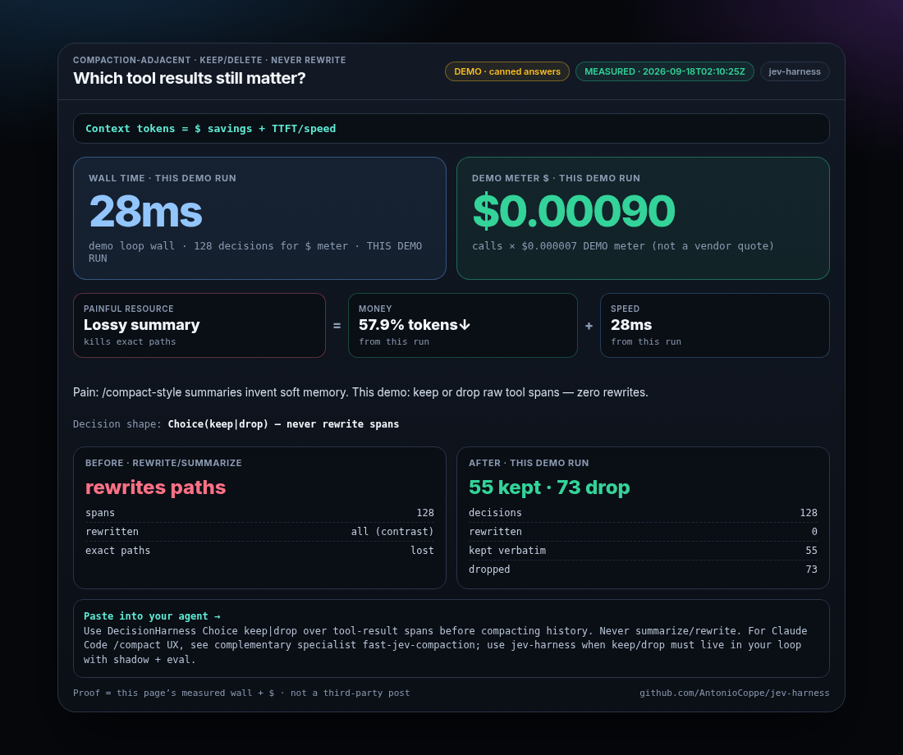
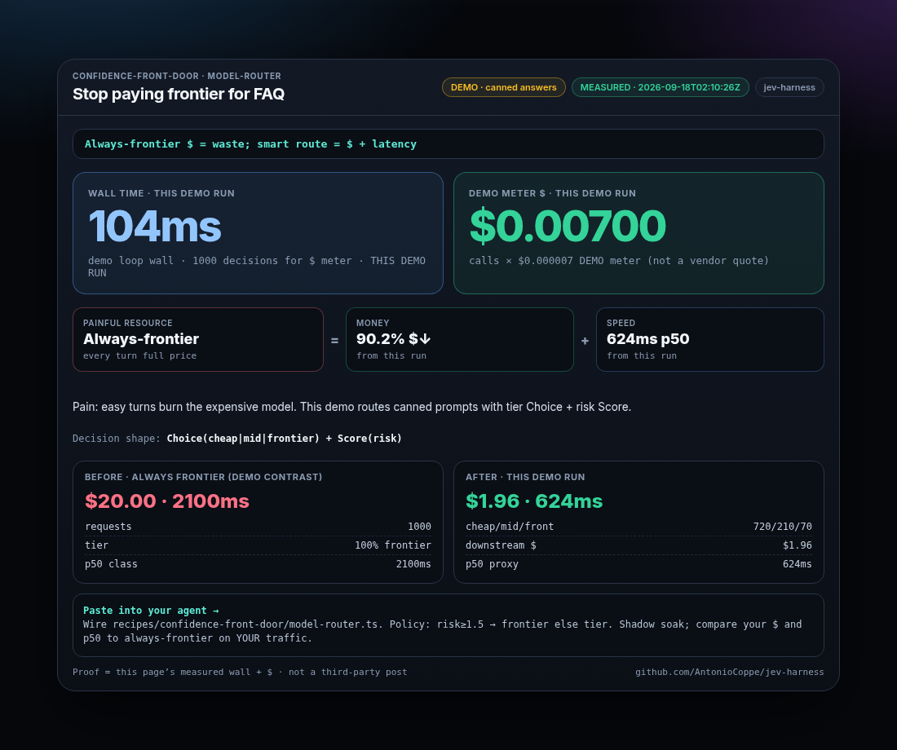
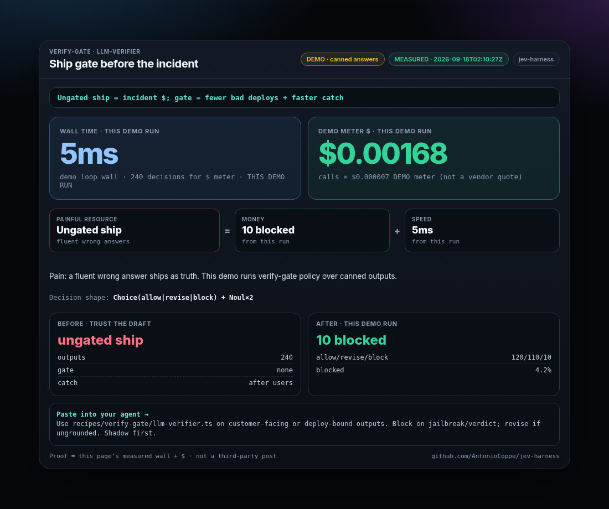
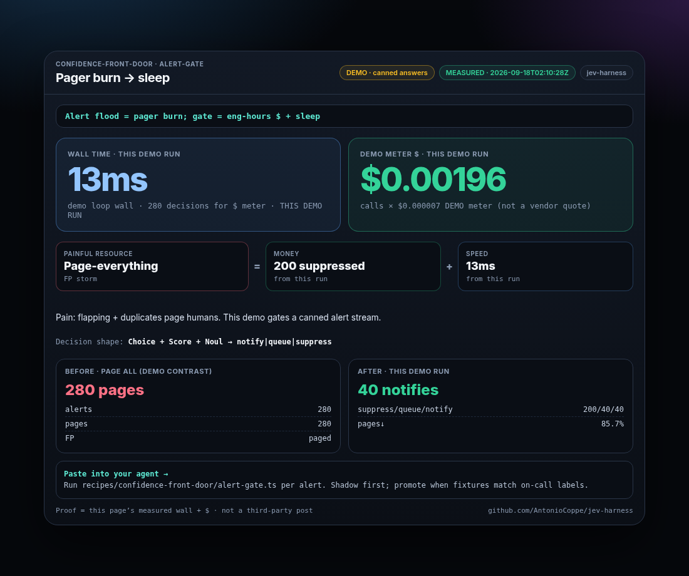
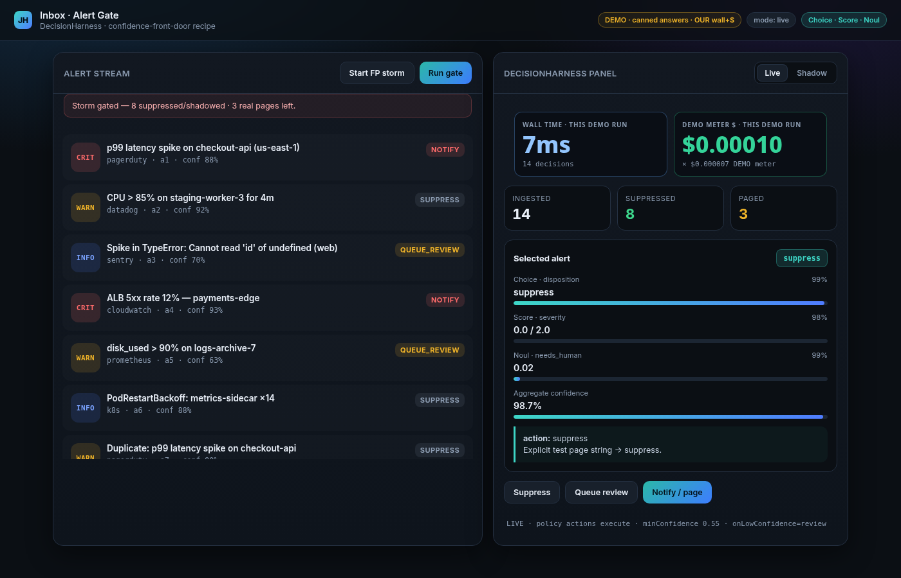
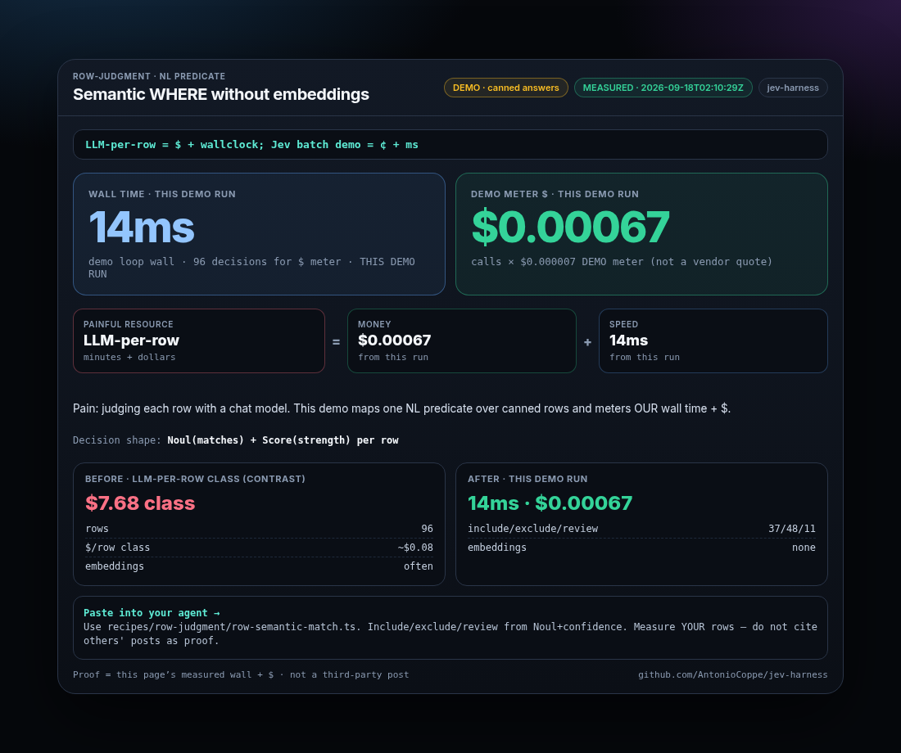
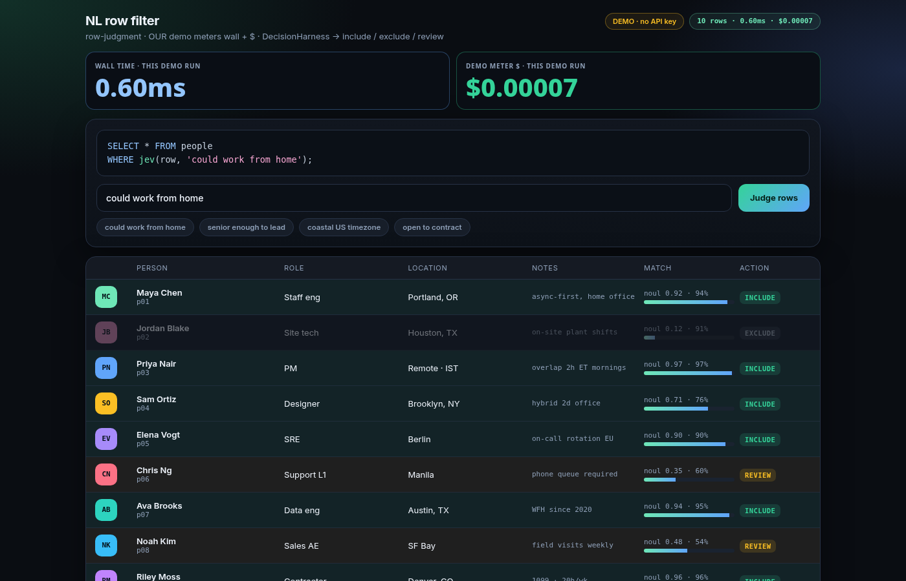
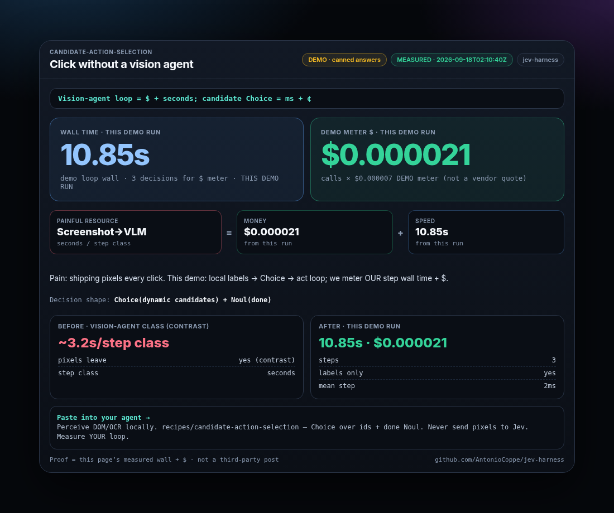
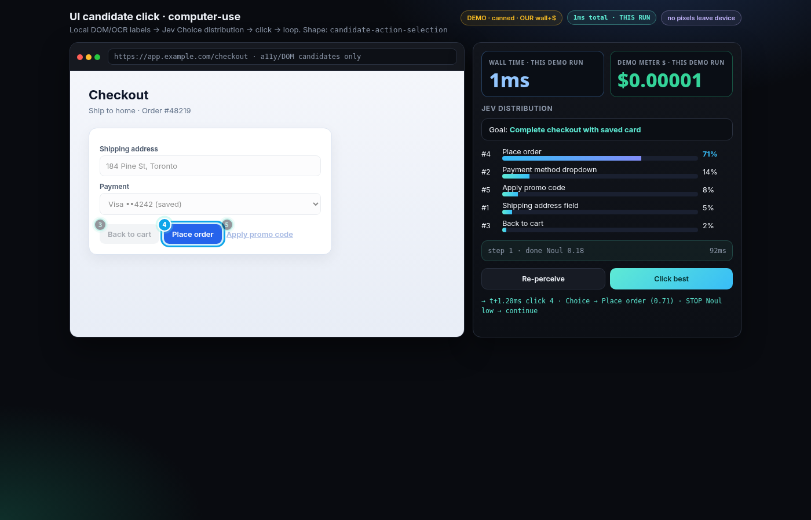

# jev-harness

**Typed decisions with proof — confidence, shadow, and policies you can eval.**

[](https://www.npmjs.com/package/jev-harness)
[](https://nodejs.org)
[](./LICENSE)
[](https://typesafe.ai)

TypeSafe [Jev](https://docs.typesafe.ai) answers `Choice` / `Score` / `Noul` with calibrated confidence. **This harness** turns answers into shipable actions: policy, confidence gates, shadow, recipes, evals.

> Compaction’s magic equation: **context window = money + speed.**  
> Below: the **next** equations. **Measured proof = real terminal screenshots**; demo UI cards are labeled mocks.

[fast-jev-compaction](https://github.com/tamaratran/fast-jev-compaction) owns context→$ for Claude Code `/compact`. **jev-harness** owns the next pack: alerts, routing, verify, filters, UI clicks — DecisionHarness + shadow + eval.

### Measured terminal proof (Claude CLI → Jev)

Same 24-row semantic filter bakeoff — wall clock from real terminals:


Offline fixture proof (`pctRoutedCheap` / `suppressOnLowConf`):



```bash
npm run eval -- eval/fixtures/model-cost-router.jsonl   # → proof.pctRoutedCheap: 70
npm run eval -- eval/fixtures/ship-gate.jsonl            # → proof.suppressOnLowConf: true
npm run eval -- eval/fixtures/alert-gate.jsonl
```

**Docs:** `npm run docs:dev` · [demos](demos/marketing/) · [paste prompts](demos/marketing/PROMPTS.md) · [crazy-fast decisions](research/crazy-fast-decisions.md) · [positioning](research/marketing-why-us.md)

---

## Savings gallery — equations with screenshots

Each card opens like compaction: **`<pain> = $<savings> + speed`**.  
Demo UI cards below are **mocks for the equation** (re-shot from `demos/marketing/`). **Measured wall-clock proof** is the terminal pair above — not these cards. We do **not** claim third-party tweet benchmarks as ours.


### 1. Context tokens = money + speed

Keep/drop tool spans — **never summarize**. Complementary to fast-jev-compaction’s `/compact` UX; use DecisionHarness when the same shape needs shadow + eval in *your* loop.



```text
Paste: Use jev-harness Choice keep|drop over tool-result spans before compact. Never summarize. Point Claude Code /compact UX at fast-jev-compaction; use DecisionHarness when the same keep/drop shape must live in your agent loop with shadow + eval.
```

---

### 2. Always-frontier = $ waste; smart route = $ + latency

Front-door tier Choice + risk Score. **Our fixture proof:** `pctRoutedCheap: 70` on `eval/fixtures/model-cost-router.jsonl`.



```text
Paste: Wire recipes/confidence-front-door/model-cost-router.ts (or model-router.ts) — Choice cheap|mid|frontier + Score risk. Policy: risk≥1.5 → frontier else tier. Shadow=1 for a week; compare $ and p50 to always-frontier. Assert with: npm run eval -- eval/fixtures/model-cost-router.jsonl
```

---

### 3. Ungated ship = incident $; confidence gate = fewer bad deploys + faster catch

Verdict Choice + grounded/jailbreak Nouls. **Our fixture proof:** `suppressOnLowConf: true` on `eval/fixtures/ship-gate.jsonl`.



```text
Paste: Use recipes/verify-gate/ship-gate.ts (or llm-verifier.ts) on every customer-facing or deploy-bound LLM output. Block if unsafe/jailbreak elevated or verdict=block; revise if grounded low. onLowConfidence → suppress. Shadow first. Assert: npm run eval -- eval/fixtures/ship-gate.jsonl
```

---

### 4. Alert flood = pager burn; gate = eng hours + sleep

Disposition Choice + severity Score + needs_human Noul. **Our fixture:** notify / suppress / queue_review / review-on-low in `eval/fixtures/alert-gate.jsonl`.





```text
Paste: Run recipes/confidence-front-door/alert-gate.ts on each alert event. Shadow mode first. Promote to live only when intendedAction matches senior on-call labels on a fixture JSONL. Try: SHADOW=1 npx tsx examples/alert-gate.ts
```

---

### 5. LLM-per-row = $ + wallclock; Jev batch = cents + seconds

Same NL predicate → Noul/Score map → threshold. **Proof = our card + mock screenshot** (run `batchFilterRows` on *your* rows to measure; we don’t publish third-party tweet $ as ours).





```text
Paste: Use recipes/row-judgment/row-semantic-match.ts (batch helper in batch.ts). Predicate like 'could work from home'. Include if Noul≥threshold & conf ok; else review. Measure $ and ms on YOUR table; put numbers in the decision log — don’t copy someone else’s tweet benchmarks.
```

---

### 6. Vision-agent loop = $ + seconds; candidate Choice = ms + cents

Local candidates → Choice → click → loop. **Proof = our card + mock** (pixels stay on-device; measure your loop).





```text
Paste: Perceive DOM/a11y/OCR locally into labeled candidates. recipes/candidate-action-selection/candidate-action-select.ts — Choice over ids + Noul done. Execute best id in code; never send pixels to Jev. Log ms/decision from YOUR loop.
```

Full prompt pack: [`demos/marketing/PROMPTS.md`](demos/marketing/PROMPTS.md). Re-shoot cards: [`demos/marketing/README.md`](demos/marketing/README.md) / `node demos/marketing/shot.mjs`.

---


---

## Crazy-fast decision recipes

When the scarce resource is **latency budget**, **decision count**, or **confidence-gated automation**, typed Choice / Score / Noul beats LLM-agent loops. Full ranking, shapes, and proof *targets*: [`research/crazy-fast-decisions.md`](research/crazy-fast-decisions.md).

**Do not invent measured timings** — equations below are the product framing; screenshot YOUR shadow/eval numbers.

| # | Recipe | Equation | Folder |
|---|---|---|---|
| 1 | Multi-agent who-speaks-next + tool allow/deny | agent RTT / tool mishap = $ + wallclock | [`recipes/agent-comm-harness/`](recipes/agent-comm-harness/) |
| 2 | Trading order allow/deny + risk throttle | adverse fills / oversize = $ + ms to cancel | [`recipes/high-freq-reflex/`](recipes/high-freq-reflex/) (`order-allow-deny`, `mm-buy-sell`, `hot-path-allow`) |
| 3 | Polymarket arb / liquidity-vs-edge gate | stale fill residual = $ + arb half-life | [`recipes/prediction-market-gate/`](recipes/prediction-market-gate/) |
| 4 | Sports betting bet/no-bet + CLV filter | −CLV bets = $ + line-move ms | [`recipes/sports-bet-gate/`](recipes/sports-bet-gate/) |
| 5 | Cybersecurity alert triage | pages / analyst hours = $ + MTTR | [`recipes/confidence-front-door/`](recipes/confidence-front-door/) (`cyber-alert-triage`, `alert-gate`, `oncall-page`) |
| 6 | Ads RTB brand-safety / bid-or-pass | bad impressions / missed auctions = $ + auction budget | [`rtb-bid-gate.ts`](recipes/high-freq-reflex/rtb-bid-gate.ts) ([alias folder](recipes/rtb-bid-gate/)) |
| 7 | Payment / login fraud score gate | chargebacks + false declines = $ + checkout ms | [`fraud-score-gate.ts`](recipes/high-freq-reflex/fraud-score-gate.ts) (+ `hot-path-allow`) |
| 8 | Content mod at the edge | toxic ships / overblocks = $ + stream lag | [`recipes/verify-gate/`](recipes/verify-gate/) (`edge-content-mod`, `ship-gate`, `llm-verifier`) |
| 9 | Esports / game reflex next-action | frames lost to planning = $ (rank) + ms/tick | [`esports-reflex.ts`](recipes/candidate-action-selection/esports-reflex.ts) |
| 10 | Swarm debate judge / consensus gate | endless debate tokens = $ + time-to-consensus | [`swarm-consensus.ts`](recipes/composite-rubric/swarm-consensus.ts) ([agent-comm re-export](recipes/agent-comm-harness/swarm-consensus.ts)) |

Paste prompts for agent-comm / polymarket / sports / trading: [`demos/marketing/PROMPTS.md`](demos/marketing/PROMPTS.md).

## Install / quick start

```bash
npm i jev-harness
export TYPESAFE_API_KEY=tsk_...   # https://typesafe.ai
```

```ts
import { DecisionHarness, choice, noul, score } from "jev-harness";

const harness = new DecisionHarness();

const result = await harness.run({
  id: "ticket-42",
  state: { subject: "Can't check out", body: "Payment hangs on submit" },
  questions: {
    bucket: choice("Which queue should own this?", {
      support: "Existing customer problem",
      billing: "Payment / invoice",
      spam: "Irrelevant",
    }),
    urgency: score("How soon must we reply?", [
      "Can wait a day",
      "Same business day",
      "Within a few hours",
    ]),
    is_customer: noul("Is this from a real customer?"),
  },
  policy: {
    minConfidence: 0.55,
    onLowConfidence: "review",
    decide: ({ answers }) => {
      if (answers.bucket.choice === "spam" || answers.is_customer.noul < 0.35) {
        return "spam";
      }
      return answers.bucket.choice;
    },
  },
});

console.log(result.action, result.confidence, result.reason);
```

```bash
SHADOW=1 TYPESAFE_API_KEY=tsk_... npx tsx examples/alert-gate.ts
npm run eval -- eval/fixtures/alert-gate.jsonl
```

---

## Concepts

| Term | Meaning |
|---|---|
| **State** | Snapshot passed to Jev. |
| **Questions** | `choice` / `score` / `noul`. |
| **Policy** | `decide` + `minConfidence` / `onLowConfidence`. |
| **Shadow** | `mode: "shadow"` → `shadow_noop` + `intendedAction`. |
| **Recipe / catalog** | Shape packs; `getRecipe`. |

---

## Catalog (shapes)

| Shape | Lead recipes |
|---|---|
| `candidate-action-selection` | `candidate-action-select`, `browser-next-action`, `tool-picker` |
| `row-judgment` | `row-semantic-match` |
| `verify-gate` | `ship-gate`, `llm-verifier`, `injection-check`, `tool-call-allowlist` |
| `confidence-front-door` | `alert-gate`, `model-cost-router`, `model-router`, `inbox-triage` |
| `composite-rubric` / `semantic-find` / `live-multi-judgment` / `high-freq-reflex` | see `recipes/catalog.ts` |
| `agent-comm-harness` *(pack)* | `who-speaks-next`, `tool-exec-gate`, `swarm-consensus` — see [crazy-fast](research/crazy-fast-decisions.md) |

---

## Advanced

Log sinks: `FileDecisionLogger` · `OtelDecisionLogger` · `PostHogDecisionLogger`.  
Batch rows: `batchFilterRows` / `mapRows`. Docs site: `npm run docs:dev`.

---

## Disclaimer

**Not affiliated with [TypeSafe](https://typesafe.ai).** Independent MIT harness; requires a TypeSafe API key + [`@typesafe-ai/sdk`](https://www.npmjs.com/package/@typesafe-ai/sdk). [fast-jev-compaction](https://github.com/tamaratran/fast-jev-compaction) is complementary (they own `/compact`). Community demos inspired shapes; **README proof numbers are from our cards + our `jev-eval` fixtures**, not third-party tweets.

## License

[MIT](./LICENSE) © [Antonio Coppe](https://github.com/AntonioCoppe)
