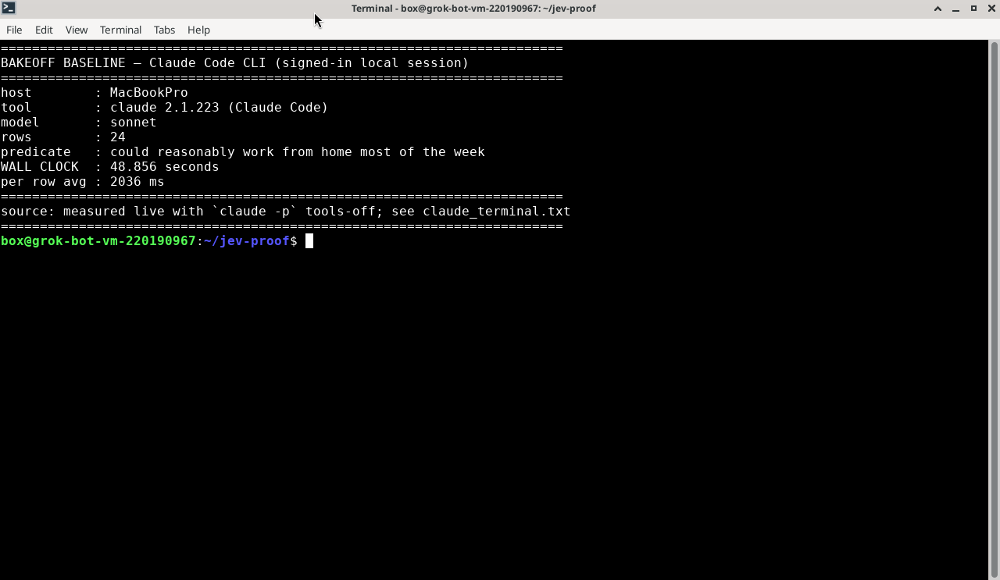
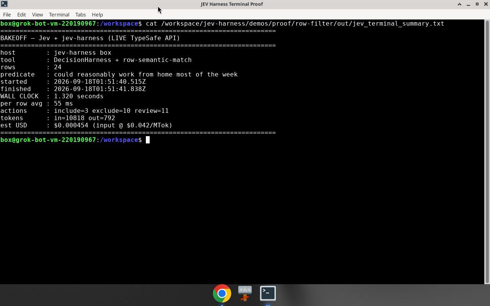
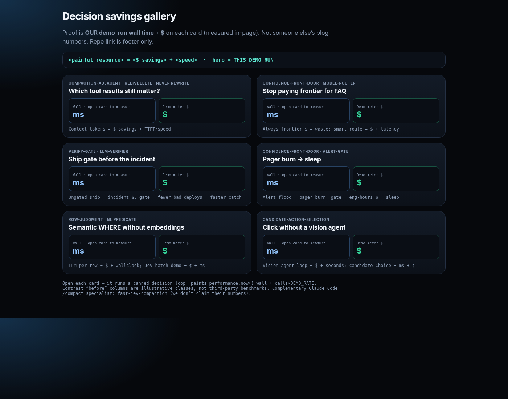

# jev-harness

A small TypeScript library that turns [TypeSafe Jev](https://docs.typesafe.ai) answers into actions you can ship.

Jev returns structured decisions (`choice` / `score` / `noul`) with confidence scores. This harness adds the missing pieces around that API: a policy, a confidence gate, shadow mode, reusable recipes, and an offline eval CLI.

It is **not** affiliated with TypeSafe. You need a TypeSafe API key to call Jev.

## Why this exists

Calling Jev once is easy. Running it in production usually needs more:

- **Policy** — map answers to an action (`notify`, `suppress`, `place`, `skip`, …)
- **Confidence gate** — if confidence is low, review / escalate / suppress instead of guessing
- **Shadow mode** — log what you *would* do without changing live behavior
- **Recipes** — copy-paste patterns for common jobs (alerts, routing, row filters, agent handoffs, …)
- **Evals** — replay fixtures and assert on the action, not on free text

## Proof (measured on our machine)

Same job: filter 24 people rows with a natural-language predicate.

| Path | Wall clock |
| --- | --- |
| Claude Code CLI (`claude -p`, tools off) | **48.9 s** |
| Jev + this harness (live API, concurrency 8) | **1.3 s** |





## Install

```sh
# until the package is on npm:
npm install github:AntonioCoppe/jev-harness
export TYPESAFE_API_KEY=tsk_...
```

Or clone and `npm install && npm run build`. Requires Node 20+.

## Quick example

```ts
import { DecisionHarness, choice, noul, score } from "jev-harness";

const harness = new DecisionHarness();

const result = await harness.run({
  id: "alert-42",
  state: { title: "Disk 92% on db-3", service: "payments" },
  questions: {
    disposition: choice("What should we do?", {
      notify: "Page someone now",
      queue: "Put in the review queue",
      suppress: "Ignore as noise",
    }),
    severity: score("How bad is this?", [
      "Low",
      "Medium",
      "High",
      "Critical",
    ]),
    needs_human: noul("Does a human need to look at this?"),
  },
  policy: {
    minConfidence: 0.55,
    onLowConfidence: "review",
    decide: ({ answers }) => {
      if (answers.disposition.choice === "suppress") return "suppress";
      if (answers.needs_human.noul >= 0.6 || answers.severity.score >= 2) {
        return "notify";
      }
      return "queue";
    },
  },
});

console.log(result.action, result.confidence, result.reason);
```

Shadow mode (no live side effects):

```ts
await harness.run({
  /* same as above */
  mode: "shadow",
});
// result.action === "shadow_noop"
// result.intendedAction === what the policy wanted
```

## Recipes

Common decision shapes live under [`recipes/`](recipes/). A few:

| Job | Folder |
| --- | --- |
| Who speaks next / tool allow-deny (multi-agent) | [`recipes/agent-comm-harness/`](recipes/agent-comm-harness/) |
| Alert / page gate | [`recipes/confidence-front-door/`](recipes/confidence-front-door/) |
| NL row filter | [`recipes/row-judgment/`](recipes/row-judgment/) |
| Order allow/deny, RTB, fraud | [`recipes/high-freq-reflex/`](recipes/high-freq-reflex/) |
| Polymarket / prediction-market gate | [`recipes/prediction-market-gate/`](recipes/prediction-market-gate/) |
| Sports bet / no-bet | [`recipes/sports-bet-gate/`](recipes/sports-bet-gate/) |
| Ship / verify LLM output | [`recipes/verify-gate/`](recipes/verify-gate/) |

Full list: [`research/crazy-fast-decisions.md`](research/crazy-fast-decisions.md).

## Eval CLI

```sh
npm run eval -- eval/fixtures/alert-gate.jsonl
```

Fixtures assert on the **action** (and optional confidence band), so you can test policy changes offline.

## Examples

```sh
SHADOW=1 TYPESAFE_API_KEY=tsk_... npx tsx examples/alert-gate.ts
npx tsx examples/model-router.ts
```

## Demo cards (optional)

UI mock cards for the common jobs (not the measured terminal proof above):



See [`demos/marketing/`](demos/marketing/) and paste prompts in [`demos/marketing/PROMPTS.md`](demos/marketing/PROMPTS.md).

## What this is not

This is **not** a Claude Code / Codex `/compact` replacement. Line-by-line keep/drop on agent history (probability filter, incomplete tool results, mid-thread deletes) is a different problem: it can bust prompt cache, drop encrypted reasoning traces, and push the model into retry loops. Prefer the lab defaults for transcript compaction. Use this harness when your app already has structured state and needs a policy + confidence gate on a decision.

## Related

- [TypeSafe Jev docs](https://docs.typesafe.ai) — the model this wraps

## License

[MIT](./LICENSE) © [Antonio Coppe](https://github.com/AntonioCoppe)
